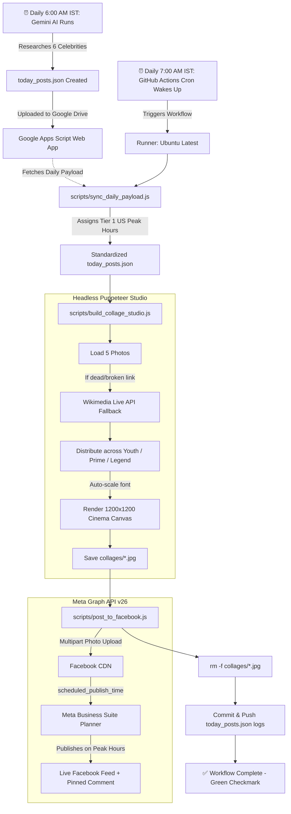

# 🌟 Hollywood Birthday Auto-Poster: Complete System Architecture & Operations Guide

> **A 100% autonomous, zero-maintenance viral celebrity birthday content factory for Facebook Pages.**  
> *Built with Node.js, Puppeteer Canvas Studio, GitHub Actions, Google Apps Script, Gemini AI, and Facebook Graph API v26.*

---

## 📑 Table of Contents
1. [System Overview & Value Proposition](#1-system-overview--value-proposition)
2. [End-to-End Workflow Diagram](#2-end-to-end-workflow-diagram)
3. [Component Architecture](#3-component-architecture)
   - [A. Gemini AI Content Architect (6:00 AM IST)](#a-gemini-ai-content-architect-600-am-ist)
   - [B. Google Drive & Apps Script Relay](#b-google-drive--apps-script-relay)
   - [C. GitHub Actions Automation Engine (7:00 AM IST)](#c-github-actions-automation-engine-700-am-ist)
   - [D. Headless Puppeteer Collage Studio](#d-headless-puppeteer-collage-studio)
   - [E. Facebook Graph API Auto-Scheduler](#e-facebook-graph-api-auto-scheduler)
4. [Double-Safe Fail-Proof Systems](#4-double-safe-fail-proof-systems)
5. [Peak Hours & Audience Optimization](#5-peak-hours--audience-optimization)
6. [Repository Hygiene & Storage Protection](#6-repository-hygiene--storage-protection)
7. [Directory & File Reference](#7-directory--file-reference)
8. [Maintenance, Manual Overrides & Testing](#8-maintenance-manual-overrides--testing)

---

## 1. System Overview & Value Proposition

The **Hollywood Birthday Auto-Poster** is an automated social media publishing pipeline. Every day, it:
1. Researches **6 famous Hollywood celebrities** born on the current calendar day.
2. Crafts high-retention storytelling packages (viral teasers, career milestones, trivia, and pinned engagement questions).
3. Sources 5 high-resolution era-separated solo portraits per celebrity (Youth, Prime, Modern Legend).
4. Generates pixel-perfect **1200×1200 high-resolution collages** using a headless studio canvas with cinema-grade typography, dynamic era badges, and viral teaser cards.
5. Schedules all 6 posts directly into **Meta Business Suite Planner** distributed across **Tier 1 US peak engagement hours**.
6. Automatically purges heavy images post-upload to keep the Git repository lightweight forever.

**Human effort required daily: Exactly 0 minutes.**

---

## 2. End-to-End Workflow Diagram



---

## 3. Component Architecture

### A. Gemini AI Content Architect (6:00 AM IST)
Every morning, the AI runs with the **Elite Celebrity Birthday Content Architect** framework. It validates birth dates using Wikipedia/IMDb and outputs a structured JSON file containing:
* `celebrity_name`, `birth_year`, `age`, `gender`, `country`
* `teaser_card`:
  * `line1`: Setup context (e.g., *"At just 4 years old,"*)
  * `line2`: Narrative setup (e.g., *"he was already"*)
  * `line2_highlight`: Emotional punch word (e.g., *"impersonating"*)
  * `line3_climax`: Punchline ending in `...` (e.g., *"Elvis..."*)
  * `badge_icon`: `'crown'`, `'star'`, or `'fire'`
  * `cta_text`: `'Read the full story in caption →'`
* `photo_urls`: 5 verified portrait URLs from `upload.wikimedia.org`.
* `caption_package`: Hook, career story, viral trivia, engagement question, and hashtags.

---

### B. Google Drive & Apps Script Relay
The generated JSON is saved to a Google Drive folder. A Google Apps Script Web App serves this data via HTTPS GET endpoint:
* **Endpoint:** `https://script.google.com/macros/s/AKfycbx7i_FHyxyLfpP3lETPAeWberFu6Q4oW5OCJBzpTy8XHu9FYSFjBkqkYth-yHXLoHECQg/exec`
* When called, it immediately returns the day's 6 celebrity packages in pure JSON format.

---

### C. GitHub Actions Automation Engine (7:00 AM IST)
Defined in [`.github/workflows/daily_post.yml`](file:///.github/workflows/daily_post.yml):
* **Schedule:** `cron: '30 1 * * *'` (1:30 AM UTC = **7:00 AM IST** every day).
* **Triggers:** Also supports manual trigger (`workflow_dispatch`) and webhook trigger (`repository_dispatch`).
* **Environment:** Node.js 20 on Ubuntu with `puppeteer` for headless rendering.

---

### D. Headless Puppeteer Collage Studio
Implemented in [`scripts/build_collage_studio.js`](file:///scripts/build_collage_studio.js):
1. **Studio Canvas (`1200×1200`):**
   * **Left (55%):** Hero contemporary portrait with dark gradient vignette, era badge (*"Present Era / Icon"*), and film grain.
   * **Right (45%):** 4-grid historical gallery displaying the celebrity's evolution (*Early Years, Breakthrough, Peak Stardom*).
   * **Header:** Celebrity name in Cinzel Gold and age in modern sans-serif. Auto-shrinks font size for long names to avoid frame clipping.
   * **Teaser Card:** Glassmorphism overlay positioned with strict bounds (`max-height: 180px`, `word-wrap: break-word`) so text never escapes the card.
2. **Typography System:**
   * Primary Display: *Cinzel* (Google Fonts)
   * UI & Badges: *Outfit* (Google Fonts)
   * Captions & Teasers: *Montserrat* / *Inter*

---

### E. Facebook Graph API Auto-Scheduler
Implemented in [`scripts/post_to_facebook.js`](file:///scripts/post_to_facebook.js):
1. **Post Scheduling:**
   * Uploads photos to `https://graph.facebook.com/v26.0/{page_id}/photos` via multipart/form-data.
   * Passes `published: false` and `scheduled_publish_time: {epoch_timestamp}`.
   * Posts are immediately deposited into the **Meta Business Suite Planner**.
2. **Unicode Bold Formatting:**
   * Converts markdown bold text (`**like this**`) into mathematical bold Unicode characters (`𝐥𝐢𝐤𝐞 𝐭𝐡𝐢𝐬`), ensuring bold text renders natively on Facebook feeds without markdown asterisks.
3. **Engagement Comment:**
   * Once published, a pinned first comment asking an interactive question (e.g., *"What is your favorite Bruno Mars song?"*) is added to stimulate comment velocity.

---

## 4. Double-Safe Fail-Proof Systems

| Risk | The Problem | Double-Safe Solution |
| :--- | :--- | :--- |
| **Broken Image URLs** | Gemini hallucinates a non-existent or dead Wikipedia link. | `build_collage_studio.js` tests HTTP status. If a URL fails, it automatically queries the live Wikimedia API for real high-res solo portrait backups. |
| **Blank Black Frames** | Celebrity only has 1 or 2 historical photos available. | The collage builder detects empty eras and re-distributes available photos across the grid so **no frame is ever left blank**. |
| **Text Overflow** | Long names (e.g., *Sigourney Weaver*, *Chevy Chase*) or 4-line teasers bleed outside the box. | Dynamic font auto-scaler recalculates font size (`font-size = clamp(...)`). Teaser card clamps max height and uses `overflow: hidden` with ellipsis. |
| **Empty Git Diffs** | All posts are already up to date, causing `git commit` to exit with error code 1. | Workflow uses `git commit ... || echo "No changes to commit"`, guaranteeing a green checkmark exit code `0`. |
| **Unwanted Deployments** | Editing a CSS or README file triggers Facebook posting. | Removed `push: branches: [main]` trigger so the poster **only runs on its 7:00 AM schedule or manual click**. |

---

## 5. Peak Hours & Audience Optimization

The scheduler distributes the 6 posts across **Tier 1 US Eastern (EDT) Peak Hours** where Facebook engagement is highest:

| Slot | US Eastern (EDT) | India Standard (IST) | Target Audience Behavior |
| :---: | :---: | :---: | :--- |
| **Slot 1** | **8:00 AM EDT** | 5:30 PM IST | Morning commute & breakfast mobile browsing |
| **Slot 2** | **10:30 AM EDT** | 8:00 PM IST | Mid-morning coffee break |
| **Slot 3** | **1:00 PM EDT** | 10:30 PM IST | Lunch hour peak scroll |
| **Slot 4** | **3:30 PM EDT** | 1:00 AM IST (next day) | Afternoon energy dip / casual browsing |
| **Slot 5** | **6:30 PM EDT** | 4:00 AM IST (next day) | Evening commute & post-work wind-down |
| **Slot 6** | **9:00 PM EDT** | 6:30 AM IST (next day) | Prime-time leisure & bed-time browsing |

---

## 6. Repository Hygiene & Storage Protection

High-resolution collages are heavy (~800 KB to 1 MB each). Accumulating 6 collages every day would add **~1.8 GB per year** into Git history, causing repository bloat.

### The Auto-Purge Solution:
1. `build_collage_studio.js` generates the 6 `.jpg` images into `collages/`.
2. `post_to_facebook.js` uploads them to Meta's servers (Meta hosts them forever on their CDN for free).
3. The workflow immediately runs:
   ```bash
   rm -f collages/*.jpg collages/*.png collages/*.webp
   ```
4. Only `today_posts.json` (logging post IDs and URLs) and `collages/.gitkeep` are committed to Git.
5. `.gitignore` explicitly ignores `collages/*.jpg` to prevent accidental tracking.

**Result:** The repository stays **under 5 MB permanently**, running in seconds with zero quota issues.

---

## 7. Directory & File Reference

```text
birthday-auto-poster-step1/
├── .github/
│   └── workflows/
│       └── daily_post.yml          # GitHub Actions cron scheduler (7:00 AM IST)
├── collage-maker/
│   ├── preset_viral_teaser.json    # Base layout and canvas style configurations
│   ├── index.html                  # Studio canvas DOM layout
│   └── style.css                   # Studio CSS styling & glassmorphism rules
├── collages/
│   └── .gitkeep                    # Retains folder structure; images purged post-upload
├── fonts/                          # Local typography assets
├── presets/
│   └── last_final_template.json    # Canonical template configuration
├── scripts/
│   ├── build_collage_studio.js     # Puppeteer headless canvas generator
│   ├── post_to_facebook.js         # Facebook Graph API upload & scheduler
│   └── sync_daily_payload.js       # Payload normalization & peak-hour assigner
├── .gitignore                      # Prevents committing binary images & temp logs
├── today_posts.json                # Daily log of active celebrities and FB post IDs
└── AUTOMATION_SYSTEM_GUIDE.md      # This complete system documentation
```

---

## 8. Maintenance, Manual Overrides & Testing

### How to Trigger Manually on GitHub:
1. Navigate to your repository on GitHub: [`aditya-Pratap15/birthday-auto-poster`](https://github.com/aditya-Pratap15/birthday-auto-poster).
2. Click the **Actions** tab.
3. Select **Daily Birthday Poster** on the left menu.
4. Click **Run workflow** $\rightarrow$ **Run workflow**.

### How to Test Locally on Your Machine:
```powershell
# 1. Fetch latest payload from Google Apps Script
node scripts/sync_daily_payload.js

# 2. Render collages with headless studio
node scripts/build_collage_studio.js

# 3. Test Facebook scheduling
node scripts/post_to_facebook.js
```

### Checking Scheduled Posts on Meta:
1. Open [Meta Business Suite](https://business.facebook.com/).
2. Click **Planner** on the left sidebar.
3. Switch to the **Month** or **Week** view to see all 6 scheduled birthday cards placed at their exact peak times.

---
*Created and maintained by Aditya Pratap. System verified and hardened on October 8, 2026.*
