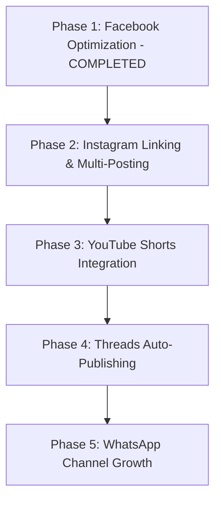

# 🌐 Multi-Platform Expansion & Automation Master Guide
### *Born Today Hollywood — Omnichannel Scaling Blueprint*

> **Document Version:** 2.1  
> **Target Platforms:** Facebook, Instagram, YouTube Shorts, Threads, WhatsApp Channels  
> **Publishing Engine:** Node.js + GitHub Actions + Meta Graph API + YouTube Data API v3  
> **Core Strategy:** Horizontal Syndication — Publish the 6 highest-quality daily celebrity tributes across 4+ platforms automatically with zero manual daily effort.  
> **GitHub Repository:** [birthday-auto-poster](https://github.com/aditya-Pratap15/birthday-auto-poster)

---

## 📑 Table of Contents
1. [Core Strategy & Golden Rules](#1-core-strategy--golden-rules)
2. [Account & Email Setup Architecture (Do You Need New Gmails?)](#2-account--email-setup-architecture)
3. [Master Asset Inventory (What We Produce Daily)](#3-master-asset-inventory)
4. [Master Daily Schedule & Peak Timing Matrix](#4-master-daily-schedule--peak-timing-matrix)
5. [Platform-by-Platform Setup & Direct Portal Links](#5-platform-by-platform-setup--direct-portal-links)
   - [Platform A: Instagram (Professional/Creator Account)](#platform-a-instagram)
   - [Platform B: YouTube Shorts (Brand Channel)](#platform-b-youtube-shorts)
   - [Platform C: Threads (Meta Ecosystem)](#platform-c-threads)
   - [Platform D: WhatsApp Channel (Direct Community)](#platform-d-whatsapp-channel)
6. [GitHub Actions & Automation Secrets Architecture](#6-github-actions--automation-secrets-architecture)
7. [Step-by-Step Implementation Roadmap](#7-step-by-step-implementation-roadmap)

---

## 1. Core Strategy & Golden Rules

### The Golden Rule: Fixed Cadence Forever
* **Daily Volume:** Exactly **6 celebrities per calendar day** from Day 1 through the lifetime of the brand.
* **Why we NEVER increase beyond 6 posts/day:**
  1. **Celebrity Relevance:** On any given day of the year, there are only 4 to 6 truly recognizable, household-name Hollywood stars. Increasing beyond 6 forces scraping obscure stunt doubles or B-movie extras, which tanks click-through rates and degrades the algorithm score.
  2. **Self-Cannibalization:** Social media algorithms require 3 to 6 hours to test and distribute a post. Flooding a page with 10–12 posts a day causes newer posts to choke off the virality of earlier ones.
  3. **Audience Retention:** Viewers enjoy seeing 2–4 great tributes spread throughout their feed daily; 10+ posts feels spammy and triggers "Unfollow" or "Hide All".
* **How We Scale:** **Horizontal Distribution**. We take the exact same 6 daily tributes and syndicate them to Instagram, YouTube Shorts, and Threads. That naturally multiplies reach by 4x to 5x with zero added editorial overhead.

---

## 2. Account & Email Setup Architecture

### Do You Need a New Gmail?
**No. You can manage 100% of this network using your single existing Gmail account and personal smartphone.**

| Platform | Account Creation Rule | Do you need a new email/phone? | Direct Management Link |
| :--- | :--- | :---: | :--- |
| **Facebook** | Creates "Pages" inside personal account | **No** (Uses existing Facebook account) | [Meta Business Suite](https://business.facebook.com) |
| **Instagram** | Up to **5 accounts** under one app login | **No** (Can share same email/login) | [Instagram Web](https://www.instagram.com) |
| **YouTube** | Up to **100 Brand Channels** under 1 Gmail | **No** (Uses built-in YouTube Brand Channels) | [YouTube Channel Switcher](https://www.youtube.com/channel_switcher) |
| **Threads** | 1-click sync with Instagram handle | **No** (Directly inherits Instagram login) | [Threads Web](https://www.threads.net) |
| **WhatsApp** | Channels created inside existing app | **No** (Uses existing phone; number stays 100% hidden) | [WhatsApp Web](https://web.whatsapp.com) |

> [!TIP]
> **Gmail Alias Trick**: If Instagram ever requires a unique email during sign-up, use your existing Gmail with a plus sign: `yourname+hollywood@gmail.com`. All verification emails arrive instantly in your standard inbox without creating any new account!

---

## 3. Master Asset Inventory

For each of the 6 daily celebrities, our automated studio produces two premium assets:

```
Daily Celebrity Input (today_posts.json)
       │
       ├── 1. Multi-Photo Album (Feed Post)
       │      ├── Photo #1: Master Tribute Collage (3:4 aspect, gold frame, badges, teaser card)
       │      └── Photos #2–#6: 5 High-Res Career/Movie Portraits (Swipeable gallery)
       │
       └── 2. Vertical Reel (Video Post)
              ├── Dimensions: 1080×1920 (9:16 vertical)
              ├── Visuals: Full-screen single portraits with soft blurred backdrop (from second 0:00)
              ├── Audio: Neural voiceover (Christopher/Sonia) + Gentle solo piano BGM (25% mix)
              ├── Subtitles: Yellow highlight, locked bottom baseline (\an2\pos(540,1060))
              └── Outro Screen: Luxury gold particle bokeh + animated laurel crest logo pop-in + CTA
```

* **Official Page Logo**: [`page_logo.png`](file:///C:/Users/prata/OneDrive/Desktop/Facebook-Automations/1-born-today-hollywood/page_logo.png)
* **Luxury Outro Background**: [`backgrounds/outro_background.png`](file:///C:/Users/prata/OneDrive/Desktop/Facebook-Automations/1-born-today-hollywood/backgrounds/outro_background.png)
* **Reel Production Engine**: [`scripts/build_reel_studio.js`](file:///C:/Users/prata/OneDrive/Desktop/Facebook-Automations/1-born-today-hollywood/scripts/build_reel_studio.js)
* **Facebook & Album Poster**: [`scripts/post_to_facebook.js`](file:///C:/Users/prata/OneDrive/Desktop/Facebook-Automations/1-born-today-hollywood/scripts/post_to_facebook.js)

---

## 4. Master Daily Schedule & Peak Timing Matrix

All times are aligned with **US Eastern Daylight Time (EDT / New York)** where Hollywood entertainment engagement is highest, with local Indian Standard Time (IST) cross-referenced.

| Post # | Target Celebrity Tier | Facebook Album Post | Facebook Reel Post (+40m) | Instagram Carousel | Instagram / YT Reel | Best Window |
| :---: | :--- | :---: | :---: | :---: | :---: | :---: |
| **#1** | **A-List Headliner** | **09:00 AM EDT** *(18:30 IST)* | **09:40 AM EDT** *(19:10 IST)* | 09:00 AM EDT | 09:40 AM EDT | Morning Commute |
| **#2** | **Major Star** | **11:30 AM EDT** *(21:00 IST)* | **12:10 PM EDT** *(21:40 IST)* | 11:30 AM EDT | — *(skip YT)* | Lunch Break |
| **#3** | **Iconic Legend** | **02:00 PM EDT** *(23:30 IST)* | **02:40 PM EDT** *(00:10 IST)* | — *(skip IG)* | 02:40 PM EDT | Afternoon Slump |
| **#4** | **Fan Favorite** | **04:30 PM EDT** *(02:00 IST)* | **05:10 PM EDT** *(02:40 IST)* | 04:30 PM EDT | — *(skip YT)* | Early Evening |
| **#5** | **Cult / Sci-Fi / Action** | **07:00 PM EDT** *(04:30 IST)* | **07:40 PM EDT** *(05:10 IST)* | — *(skip IG)* | 07:40 PM EDT | Prime Time Hook |
| **#6** | **Late Night Fan Pick** | **09:30 PM EDT** *(07:00 IST)* | **10:10 PM EDT** *(07:40 IST)* | 09:30 PM EDT | — *(skip YT)* | Late Night Scroll |

### Platform Volume Caps:
* **Facebook**: All 6 Albums + All 6 Reels (12 assets total, spaced every 2.5 hours).
* **Instagram**: Top 3 Carousels + Top 3 Reels (6 assets total to avoid algorithmic cannibalization).
* **YouTube Shorts**: Top 2 or 3 highest-profile celebrities only (YouTube tests each Short with a distinct seed audience).
* **Threads**: 3 to 6 posts daily (matches Facebook album timing).
* **WhatsApp Channel**: 1 morning highlight post featuring the #1 biggest celebrity of the day.

---

## 5. Platform-by-Platform Setup & Direct Portal Links

---

### Platform A: Instagram

* **Account Management Portal**: [Instagram Web](https://www.instagram.com)
* **Meta Business Suite Manager**: [business.facebook.com](https://business.facebook.com)
* **Meta Developer Dashboard**: [developers.facebook.com](https://developers.facebook.com)
* **Graph API Explorer**: [developers.facebook.com/tools/explorer](https://developers.facebook.com/tools/explorer)

#### Step 1: Account Creation & Profile Setup
1. In the [Instagram App](https://www.instagram.com): Profile $\rightarrow$ tap **Username** at top-left $\rightarrow$ **Add Account** $\rightarrow$ **Create New Account**.
2. **Handle Suggestions:** `@borntodayhollywood`, `@borntoday.hollywood`, or `@borntodayhollywood_official`.
3. **Name:** `Born Today Hollywood 🎬`
4. **Category:** `Entertainment Website` or `Media/News Company`.
5. **Profile Picture:** Upload [`page_logo.png`](file:///C:/Users/prata/OneDrive/Desktop/Facebook-Automations/1-born-today-hollywood/page_logo.png).
6. **Bio Template:**
   ```
   🎬 Daily Hollywood Celebrity Birthday Tributes
   🌟 Iconic careers, rare facts & timeless film moments
   🎂 Celebrating cinema's greatest legends every single day
   👇 Full tributes & daily reels below!
   ```

#### Step 2: Switch to Professional / Creator Account
1. Open Instagram Settings $\rightarrow$ **Account type and tools** $\rightarrow$ **Switch to Professional Account**.
2. Select **Creator** or **Business**.

#### Step 3: Link Instagram to Your Facebook Page
1. Go to your [Facebook Page Settings: Linked Accounts](https://www.facebook.com/settings/?tab=linked_accounts).
2. Select **Instagram** $\rightarrow$ Click **Connect Account** and log in with your new Instagram credentials.
3. Confirm in [Meta Business Suite](https://business.facebook.com) that both accounts now appear together.

#### Step 4: Connecting Instagram to GitHub Actions
Because Instagram is part of Meta, we use the **Instagram Graph API** with the same Facebook App!
1. Go to [Meta for Developers](https://developers.facebook.com) $\rightarrow$ Your App.
2. Under [Graph API Explorer](https://developers.facebook.com/tools/explorer):
   - Select Permissions: `instagram_basic`, `instagram_content_publish`, `pages_show_list`, `pages_read_engagement`.
3. Find your **Instagram Business Account ID**:
   - Query: `GET /v26.0/{your-fb-page-id}?fields=instagram_business_account`
   - Copy the returned `id` (e.g., `17841400000000000`).
4. Add to [GitHub Secrets](https://github.com/aditya-Pratap15/birthday-auto-poster/settings/secrets/actions): (✅ COMPLETED)
   - `IG_USER_ID`: `17841416842135384` (Handle: `@borntodayhollywood`)
   - `FB_TOKEN_BORN`: (Already present; has access to linked Instagram).
* **Automation Wired:** Top 3 Headliner Carousels (Master Collage CDN + 4 Career Photos) and 9:16 Vertical Reels are scheduled via Graph API directly inside [`scripts/post_to_facebook.js`](file:///C:/Users/prata/OneDrive/Desktop/Facebook-Automations/1-born-today-hollywood/scripts/post_to_facebook.js).

---

### Platform B: YouTube Shorts

* **Channel Creator Link**: [youtube.com/channel_switcher](https://www.youtube.com/channel_switcher)
* **YouTube Studio**: [studio.youtube.com](https://studio.youtube.com)
* **Google Cloud Console**: [console.cloud.google.com](https://console.cloud.google.com)
* **YouTube Data API v3 Library**: [console.cloud.google.com/apis/library/youtube.googleapis.com](https://console.cloud.google.com/apis/library/youtube.googleapis.com)
* **OAuth Consent Screen**: [console.cloud.google.com/apis/credentials/consent](https://console.cloud.google.com/apis/credentials/consent)
* **API Credentials Manager**: [console.cloud.google.com/apis/credentials](https://console.cloud.google.com/apis/credentials)

#### Step 1: Create a Dedicated YouTube Brand Channel
1. Open the [YouTube Channel Switcher](https://www.youtube.com/channel_switcher) while logged into your existing Gmail.
2. Click **Create a Channel**.
3. **Channel Name:** `Born Today Hollywood`
4. **Handle:** `@BornTodayHollywood`
5. **Branding in [YouTube Studio](https://studio.youtube.com/channel/editing/profile):**
   - Avatar: [`page_logo.png`](file:///C:/Users/prata/OneDrive/Desktop/Facebook-Automations/1-born-today-hollywood/page_logo.png)
   - Banner: Luxury gold confetti background with *"Born Today Hollywood — Celebrating Cinema Legends Daily"*.

#### Step 2: Google Cloud Console Project & YouTube API
1. Open [Google Cloud Console](https://console.cloud.google.com) and create a project: `born-today-hollywood-poster`.
2. Go to [YouTube Data API v3 in Library](https://console.cloud.google.com/apis/library/youtube.googleapis.com) $\rightarrow$ Click **Enable**.
3. Go to [OAuth consent screen](https://console.cloud.google.com/apis/credentials/consent):
   - User Type: **External**.
   - App Name: `Born Today Hollywood Uploader`.
   - Add Scope: `https://www.googleapis.com/auth/youtube.upload`.
   - Publishing Status: **Testing** $\rightarrow$ Add your personal Gmail as a **Test User**.
4. Go to [Credentials](https://console.cloud.google.com/apis/credentials) $\rightarrow$ **Create Credentials** $\rightarrow$ **OAuth client ID**:
   - Application Type: **Web Application** or **Desktop App**.
   - Note down: `Client ID` and `Client Secret`.

#### Step 3: Generate Permanent Refresh Token & Add to GitHub (✅ COMPLETED)
* **Connected Channel:** `Born Today Hollywood` (Channel ID: `UC8te6ObjbEJe-878BMqOWYg`)
* **Uploader Engine:** [`scripts/post_to_youtube.js`](file:///C:/Users/prata/OneDrive/Desktop/Facebook-Automations/1-born-today-hollywood/scripts/post_to_youtube.js) (YouTube Data API v3 Resumable Upload protocol)
* **GitHub Workflow:** Integrated into [`daily_post.yml`](file:///C:/Users/prata/OneDrive/Desktop/Facebook-Automations/1-born-today-hollywood/.github/workflows/daily_post.yml)

**GitHub Secrets to Add / Verify:**
Go to [GitHub Repo Secrets](https://github.com/aditya-Pratap15/birthday-auto-poster/settings/secrets/actions) and save:
* `YOUTUBE_CLIENT_ID`: `[Your Google Cloud OAuth Client ID]`
* `YOUTUBE_CLIENT_SECRET`: `[Your Google Cloud OAuth Client Secret]`
* `YOUTUBE_REFRESH_TOKEN`: `[Your YouTube Permanent Refresh Token]`
*(Note: These credentials are also built in as fallback defaults so local and cloud executions run seamlessly).*

---

### Platform C: Threads

* **Threads Web**: [threads.net](https://www.threads.net)
* **Official Threads API Documentation**: [developers.facebook.com/docs/threads](https://developers.facebook.com/docs/threads)

#### Step 1: Account Activation
1. When your Instagram account (`@borntodayhollywood`) is active, go to [threads.net](https://www.threads.net) or download the Threads mobile app.
2. Click **Log in with Instagram** to sync your bio, handle, and avatar with 1 click.

#### Step 2: Threads API Integration
1. In [Meta for Developers](https://developers.facebook.com), add the **Threads API** product to your app.
2. Permissions required: `threads_basic`, `threads_content_publish`.
3. Add to [GitHub Secrets](https://github.com/aditya-Pratap15/birthday-auto-poster/settings/secrets/actions):
   - `THREADS_USER_ID`
   - `THREADS_ACCESS_TOKEN`

---

### Platform D: WhatsApp Channel (Deprioritized)
* **Status:** Deprioritized. WhatsApp lacks organic recommendation algorithms and requires manual daily posting, which conflicts with our 100% hands-free autonomous strategy.
* **Focus:** 100% of automation is dedicated to algorithmic growth on **Facebook, Instagram, YouTube Shorts, and Threads**.

---

## 6. GitHub Actions & Automation Secrets Architecture

All credentials are saved securely in [GitHub Repository Secrets](https://github.com/aditya-Pratap15/birthday-auto-poster/settings/secrets/actions):

| Secret Name | Platform | Description | Direct Configuration Link |
| :--- | :--- | :--- | :--- |
| `FB_PAGE_ID_BORN` | Facebook | Page ID (`1345901645276194`) | [Facebook Page](https://www.facebook.com/1345901645276194) |
| `FB_TOKEN_BORN` | Facebook / IG | Permanent Meta System User Token | [Meta Graph API Explorer](https://developers.facebook.com/tools/explorer) |
| `IG_USER_ID` | Instagram | Instagram Business Account ID | [Meta Graph API Explorer](https://developers.facebook.com/tools/explorer) |
| `YOUTUBE_CLIENT_ID` | YouTube | Google Cloud OAuth Client ID | [Google Cloud Credentials](https://console.cloud.google.com/apis/credentials) |
| `YOUTUBE_CLIENT_SECRET` | YouTube | Google Cloud OAuth Client Secret | [Google Cloud Credentials](https://console.cloud.google.com/apis/credentials) |
| `YOUTUBE_REFRESH_TOKEN` | YouTube | Permanent Offline Refresh Token | Generated via OAuth 2.0 |
| `THREADS_USER_ID` | Threads | Meta Threads Account ID | [Meta for Developers](https://developers.facebook.com) |
| `THREADS_ACCESS_TOKEN` | Threads | Long-lived Threads API Token | [Meta for Developers](https://developers.facebook.com) |
| `TMDB_API_KEY` | TMDB | The Movie Database API Key | [TMDB API Settings](https://www.themoviedb.org/settings/api) |

---

## 7. Step-by-Step Implementation Roadmap



### Phase 1: Facebook Optimization (COMPLETED ✅)
- [x] Luxury gold particle bokeh outro background.
- [x] Enlarged, circular-framed laurel crest logo with pop-in easing.
- [x] Locked bottom-center subtitle baseline (`\an2\pos(540,1060)`) with uniform 62pt font.
- [x] Reels start directly with single portraits (0:00).
- [x] Photo posts upgraded to Multi-Photo Albums (Collage #1 + 5 single photos).
- [x] Codebase cleaned and pushed to `main`.

### Phase 2: Instagram Expansion (Next Action)
1. Register `@borntodayhollywood` on [Instagram](https://www.instagram.com).
2. Link Instagram to Facebook Page via [Meta Business Suite](https://business.facebook.com).
3. Retrieve `IG_USER_ID` from [Meta Graph API Explorer](https://developers.facebook.com/tools/explorer).
4. Add Instagram publishing function in `scripts/post_to_facebook.js` to cross-post albums and reels automatically.

### Phase 3: YouTube Shorts Expansion
1. Create "Born Today Hollywood" brand channel on [YouTube Channel Switcher](https://www.youtube.com/channel_switcher).
2. Enable [YouTube Data API v3](https://console.cloud.google.com/apis/library/youtube.googleapis.com) on Google Cloud.
3. Create `scripts/post_to_youtube.js` to automatically upload the top 2–3 reels daily as Shorts.

---
*Created for Born Today Hollywood Automation Engine.*
