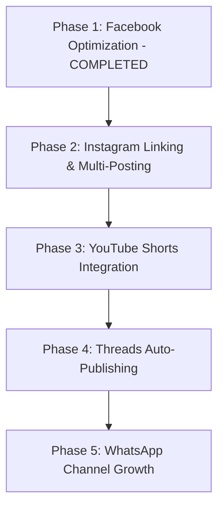

# 🌐 Multi-Platform Expansion & Automation Master Guide
### *Born Today Hollywood — Omnichannel Scaling Blueprint*

> **Document Version:** 2.0  
> **Target Platforms:** Facebook, Instagram, YouTube Shorts, Threads, WhatsApp Channels  
> **Publishing Engine:** Node.js + GitHub Actions + Meta Graph API + YouTube Data API v3  
> **Core Strategy:** Horizontal Syndication — Publish the 6 highest-quality daily celebrity tributes across 4+ platforms automatically with zero manual daily effort.

---

## 📑 Table of Contents
1. [Core Strategy & Golden Rules](#1-core-strategy--golden-rules)
2. [Master Asset Inventory (What We Produce Daily)](#2-master-asset-inventory)
3. [Master Daily Schedule & Peak Timing Matrix](#3-master-daily-schedule--peak-timing-matrix)
4. [Platform-by-Platform Setup & Connection Guide](#4-platform-by-platform-setup--connection-guide)
   - [Platform A: Instagram (Professional/Creator Account)](#platform-a-instagram)
   - [Platform B: YouTube Shorts (Brand Channel)](#platform-b-youtube-shorts)
   - [Platform C: Threads (Meta Ecosystem)](#platform-c-threads)
   - [Platform D: WhatsApp Channel (Direct Community)](#platform-d-whatsapp-channel)
5. [GitHub Actions & Automation Secrets Architecture](#5-github-actions--automation-secrets-architecture)
6. [Step-by-Step Implementation Roadmap](#6-step-by-step-implementation-roadmap)

---

## 1. Core Strategy & Golden Rules

### The Golden Rule: Fixed Cadence Forever
* **Daily Volume:** Exactly **6 celebrities per calendar day** from Day 1 through the lifetime of the brand.
* **Why we NEVER increase beyond 6 posts/day:**
  1. **Celebrity Relevance:** On any given day of the year, there are only 4 to 6 truly recognizable, household-name Hollywood stars. Increasing beyond 6 forces scraping obscure stunt doubles or B-movie extras, which tanks click-through rates and degrades the algorithm score.
  2. **Self-Cannibalization:** Social media algorithms require 3 to 6 hours to test and distribute a post. Flooding a page with 10–12 posts a day causes newer posts to choke off the virality of earlier ones.
  3. **Audience Retention:** Viewers enjoy seeing 2–4 great tributes spread throughout their feed daily; 10+ posts feels spammy and triggers "Unfollow" or "Hide All".
* **How We Scale:** **Horizontal Distribution**. We take the exact same 6 daily tributes and syndicate them to Instagram, YouTube Shorts, and Threads. That naturally multiplies reach by 4x to 5x with zero added editorial overhead.

---

## 2. Master Asset Inventory

For each of the 6 daily celebrities, our automated studio produces two premium assets:

```
Daily Celebrity Input (today_posts.json)
       │
       ├── 1. Multi-Photo Album (Feed Post)
       │      ├── Photo #1: Master Tribute Collage (3:4 aspect, gold frame, badges, teaser card)
       │      └── Photos #2–#6: 5 High-Res Career/Movie Portraits (Swipeable gallery)
       │
       └── 2. Vertical Reel (Video Post)
              ├── Dimensions: 1080×1920 (9:16 vertical)
              ├── Visuals: Full-screen single portraits with soft blurred backdrop (from second 0:00)
              ├── Audio: Neural voiceover (Christopher/Sonia) + Gentle solo piano BGM (25% mix)
              ├── Subtitles: Yellow highlight, locked bottom baseline (\an2\pos(540,1060))
              └── Outro Screen: Luxury gold particle bokeh + animated laurel crest logo pop-in + CTA
```

---

## 3. Master Daily Schedule & Peak Timing Matrix

All times are aligned with **US Eastern Daylight Time (EDT / New York)** where Hollywood entertainment engagement is highest, with local Indian Standard Time (IST) cross-referenced.

| Post # | Target Celebrity Tier | Facebook Album Post | Facebook Reel Post (+40m) | Instagram Carousel | Instagram / YT Reel | Best Window |
| :---: | :--- | :---: | :---: | :---: | :---: | :---: |
| **#1** | **A-List Headliner** | **09:00 AM EDT** *(18:30 IST)* | **09:40 AM EDT** *(19:10 IST)* | 09:00 AM EDT | 09:40 AM EDT | Morning Commute |
| **#2** | **Major Star** | **11:30 AM EDT** *(21:00 IST)* | **12:10 PM EDT** *(21:40 IST)* | 11:30 AM EDT | — *(skip YT)* | Lunch Break |
| **#3** | **Iconic Legend** | **02:00 PM EDT** *(23:30 IST)* | **02:40 PM EDT** *(00:10 IST)* | — *(skip IG)* | 02:40 PM EDT | Afternoon Slump |
| **#4** | **Fan Favorite** | **04:30 PM EDT** *(02:00 IST)* | **05:10 PM EDT** *(02:40 IST)* | 04:30 PM EDT | — *(skip YT)* | Early Evening |
| **#5** | **Cult / Sci-Fi / Action** | **07:00 PM EDT** *(04:30 IST)* | **07:40 PM EDT** *(05:10 IST)* | — *(skip IG)* | 07:40 PM EDT | Prime Time Hook |
| **#6** | **Late Night Fan Pick** | **09:30 PM EDT** *(07:00 IST)* | **10:10 PM EDT** *(07:40 IST)* | 09:30 PM EDT | — *(skip YT)* | Late Night Scroll |

### Platform Volume Caps:
* **Facebook**: All 6 Albums + All 6 Reels (12 assets total, spaced every 2.5 hours).
* **Instagram**: Top 3 Carousels + Top 3 Reels (6 assets total to avoid algorithmic cannibalization).
* **YouTube Shorts**: Top 2 or 3 highest-profile celebrities only (YouTube tests each Short with a distinct seed audience).
* **Threads**: 3 to 6 posts daily (matches Facebook album timing).
* **WhatsApp Channel**: 1 morning highlight post featuring the #1 biggest celebrity of the day.

---

## 4. Platform-by-Platform Setup & Connection Guide

---

### Platform A: Instagram

#### Step 1: Account Creation & Profile Setup
1. Create a new Instagram account using your official business email.
2. **Handle Suggestions:** `@borntodayhollywood`, `@borntoday.hollywood`, or `@borntodayhollywood_official`.
3. **Name:** `Born Today Hollywood 🎬`
4. **Category:** `Entertainment Website` or `Media/News Company`.
5. **Profile Picture:** Upload the official laurel crest logo (`page_logo.png`).
6. **Bio Template:**
   ```
   🎬 Daily Hollywood Celebrity Birthday Tributes
   🌟 Iconic careers, rare facts & timeless film moments
   🎂 Celebrating cinema's greatest legends every single day
   👇 Full tributes & daily reels below!
   ```

#### Step 2: Switch to Professional / Creator Account
1. Open Instagram Settings $\rightarrow$ **Account type and tools** $\rightarrow$ **Switch to Professional Account**.
2. Select **Creator** or **Business**.

#### Step 3: Link Instagram to Your Facebook Page
1. Go to your **Facebook Page: Born Today Hollywood** (`1345901645276194`).
2. Go to **Page Settings** $\rightarrow$ **Linked Accounts** $\rightarrow$ **Instagram**.
3. Click **Connect Account** and log in with your Instagram credentials.
4. Confirm in **Meta Business Suite** that both accounts now appear together.

#### Step 4: Connecting Instagram to GitHub Actions
Because Instagram is part of Meta, we use the **Instagram Graph API** with the same Facebook App!
1. Go to **Meta for Developers** (`developers.facebook.com`) $\rightarrow$ Your App.
2. Under **Graph API Explorer**:
   - Select Permissions:
     - `instagram_basic`
     - `instagram_content_publish`
     - `pages_show_list`
     - `pages_read_engagement`
3. Find your **Instagram Business Account ID**:
   - Query: `GET /v26.0/{your-fb-page-id}?fields=instagram_business_account`
   - Copy the returned `id` (e.g., `17841400000000000`).
4. Add to GitHub Secrets:
   - `IG_USER_ID`: Your Instagram Business Account ID.
   - `FB_TOKEN_BORN`: (Already present; has access to linked Instagram).

---

### Platform B: YouTube Shorts

#### Step 1: Create a Dedicated YouTube Brand Channel
1. Go to **YouTube** while logged into your Google account $\rightarrow$ Click your profile avatar $\rightarrow$ **Settings**.
2. Click **Add or manage your channels** $\rightarrow$ **Create a Channel**.
3. **Channel Name:** `Born Today Hollywood`
4. **Handle:** `@BornTodayHollywood`
5. **Branding:**
   - Avatar: `page_logo.png`
   - Banner: Luxury gold confetti background with *"Born Today Hollywood — Celebrating Cinema Legends Daily"*.

#### Step 2: Google Cloud Console Project & YouTube API
1. Go to **Google Cloud Console** (`console.cloud.google.com`).
2. Create a new project: `born-today-hollywood-poster`.
3. Go to **APIs & Services** $\rightarrow$ **Library** $\rightarrow$ Search for **YouTube Data API v3** $\rightarrow$ Click **Enable**.
4. Go to **OAuth consent screen**:
   - User Type: **External**.
   - App Name: `Born Today Hollywood Uploader`.
   - Add Scope: `https://www.googleapis.com/auth/youtube.upload`.
   - Publishing Status: **Testing** $\rightarrow$ Add your personal Gmail as a **Test User**.
5. Go to **Credentials** $\rightarrow$ **Create Credentials** $\rightarrow$ **OAuth client ID**:
   - Application Type: **Desktop App** or **Web Application**.
   - Note down: `Client ID` and `Client Secret`.

#### Step 3: Generate Permanent Refresh Token
1. Run a one-time OAuth consent script in Node.js to authorize your YouTube channel.
2. Authorize with your channel's Google account to receive a **Refresh Token**.
3. Add to GitHub Secrets:
   - `YOUTUBE_CLIENT_ID`
   - `YOUTUBE_CLIENT_SECRET`
   - `YOUTUBE_REFRESH_TOKEN`

---

### Platform C: Threads

#### Step 1: Account Activation
1. When your Instagram account (`@borntodayhollywood`) is active, open the **Threads app** or go to `threads.net`.
2. Tap **Log in with Instagram** to import your bio, logo, and verified link instantly.

#### Step 2: Threads API Integration
1. Go to **Meta for Developers** $\rightarrow$ Add **Threads API** use case.
2. Permissions required:
   - `threads_basic`
   - `threads_content_publish`
3. Posting mechanism:
   - Step 1: Create media container: `POST https://graph.threads.net/v1.0/{threads-user-id}/threads?media_type=IMAGE&image_url=...&text=...`
   - Step 2: Publish container: `POST https://graph.threads.net/v1.0/{threads-user-id}/threads_publish?creation_id={container-id}`
4. Add to GitHub Secrets:
   - `THREADS_USER_ID`
   - `THREADS_ACCESS_TOKEN`

---

### Platform D: WhatsApp Channel

#### Step 1: Channel Creation
1. Open **WhatsApp** on mobile or desktop $\rightarrow$ Go to the **Updates** tab.
2. Tap **Channels (+)** $\rightarrow$ **Create Channel**.
3. **Channel Name:** `Born Today Hollywood 🎬`
4. **Description:**
   ```
   Daily birthday tributes, iconic film trivia, and career retrospects for Hollywood's greatest legends! 🎂⭐
   ```
5. **Channel Icon:** Upload the laurel logo.

#### Step 2: Distribution Strategy
1. Copy the public **Channel Invite Link**.
2. Add this link to your **Instagram Link in Bio**, **YouTube Channel description**, and the pinned first comment on Facebook.
3. Post **1 daily curated tribute** (the single biggest celebrity of the day) each morning at 9:00 AM EDT.

---

## 5. GitHub Actions & Automation Secrets Architecture

All automation credentials are stored securely in **GitHub Repository Secrets** (`Settings` $\rightarrow$ `Secrets and variables` $\rightarrow$ `Actions`):

| Secret Name | Platform | Description |
| :--- | :--- | :--- |
| `FB_PAGE_ID_BORN` | Facebook | Page ID (`1345901645276194`) |
| `FB_TOKEN_BORN` | Facebook / IG | Permanent Meta System User Token |
| `IG_USER_ID` | Instagram | Instagram Business Account ID |
| `YOUTUBE_CLIENT_ID` | YouTube | Google Cloud OAuth Client ID |
| `YOUTUBE_CLIENT_SECRET` | YouTube | Google Cloud OAuth Client Secret |
| `YOUTUBE_REFRESH_TOKEN` | YouTube | Permanent Offline Refresh Token |
| `THREADS_USER_ID` | Threads | Meta Threads Account ID |
| `THREADS_ACCESS_TOKEN` | Threads | Long-lived Threads API Token |
| `TMDB_API_KEY` | TMDB | The Movie Database API Key |

---

## 6. Step-by-Step Implementation Roadmap



### Phase 1: Facebook Optimization (COMPLETED ✅)
- [x] Luxury gold particle bokeh outro background.
- [x] Enlarged, circular-framed laurel crest logo with pop-in easing.
- [x] Locked bottom-center subtitle baseline (`\an2\pos(540,1060)`) with uniform 62pt font.
- [x] Reels start directly with single portraits (0:00).
- [x] Photo posts upgraded to Multi-Photo Albums (Collage #1 + 5 single photos).
- [x] Codebase cleaned and pushed to `main`.

### Phase 2: Instagram Expansion (Next Action)
1. Register `@borntodayhollywood` on Instagram.
2. Link Instagram to Facebook Page via Meta Business Suite.
3. Retrieve `IG_USER_ID`.
4. Add Instagram publishing function in `scripts/post_to_facebook.js` to cross-post albums and reels automatically.

### Phase 3: YouTube Shorts Expansion
1. Create "Born Today Hollywood" brand channel on YouTube.
2. Enable YouTube Data API v3 on Google Cloud.
3. Create `scripts/post_to_youtube.js` to automatically upload the top 2–3 reels daily as Shorts.

---
*Created for Born Today Hollywood Automation Engine.*
